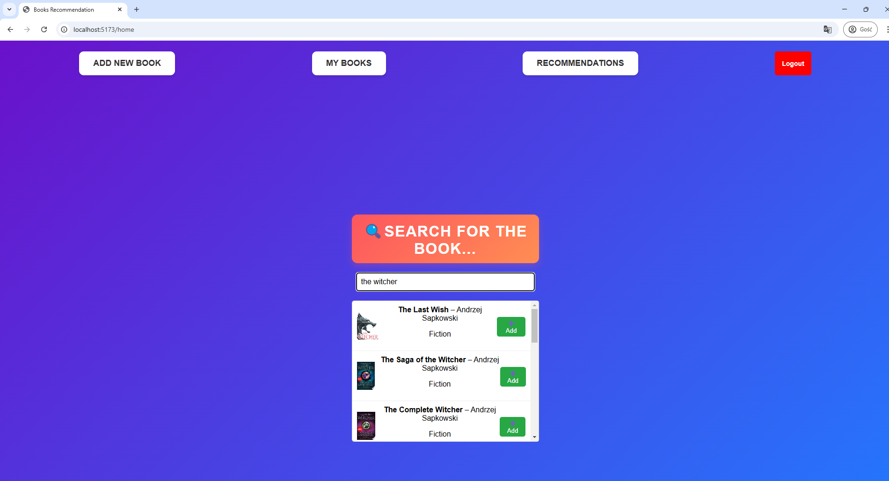

# 📖 Books Recommendation App

## 📝 **Table of contents**
* [General info](#-general-info)
* [SCREENSHOTS](#-screenshots)
---
## 🚀 **General info**
- Login / Register feature available
- Recommendations calculated via dynamic [Marqo Vector Database](https://www.marqo.ai/)
- You can search and add your book to the list

---
## 📷 **Screenshots**

  
  
  

